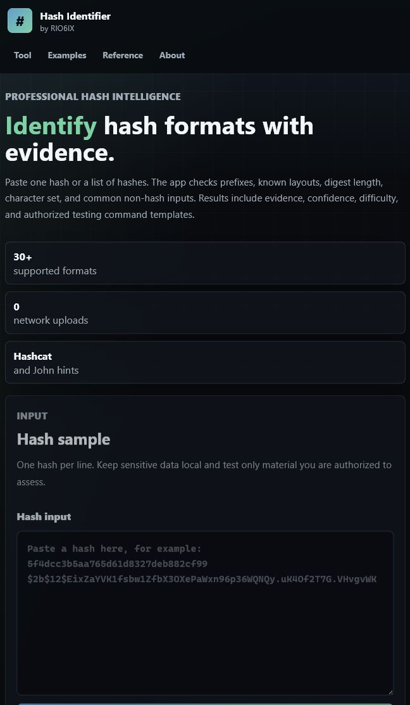

# Hash Identifier

Hash Identifier is a professional, client-side web application for identifying likely hash formats from visible structure. It looks at prefix markers, digest length, character set, and known hash patterns, then returns evidence-based candidates with confidence levels and authorized testing command hints.



## What It Does

- Identifies common hash families such as MD5, SHA, bcrypt, Argon2, scrypt, MySQL, NetNTLM, Unix crypt, phpass, Django, Drupal, and LDAP formats.
- Explains why each candidate matched, including length, bit size, prefix, charset, or known layout evidence.
- Shows practical metadata such as confidence level, Hashcat mode, John the Ripper format, and general cracking difficulty.
- Generates command templates for authorized testing workflows.
- Detects common non-hash inputs such as JWTs, URLs, Base32, Base58, Base64 blobs, and `0x` prefixed hex.
- Runs fully in the browser. No backend, no upload, no tracking, and no stored input.

## Live Demo

Access the web app here:

<https://rio6ix.github.io/Hash-Identifier/>

Repository: <https://github.com/RIO6IX/Hash-Identifier>

## Quick Start

Clone the repository and open `index.html` in a browser:

```bash
git clone https://github.com/RIO6IX/Hash-Identifier.git
cd Hash-Identifier
```

For a local preview server:

```bash
python -m http.server 4173
```

Then open:

```text
http://127.0.0.1:4173/
```

## Example Inputs

```text
5f4dcc3b5aa765d61d8327deb882cf99
```

Likely result: `MD5`, with `NTLM`, `MD4`, and `RIPEMD-128` as lower-confidence alternatives because they also produce 32 hex characters.

```text
$2b$12$EixZaYVK1fsbw1ZfbX3OXePaWxn96p36WQNQy.uK4Of2T7G.VHvgvWK
```

Likely result: `bcrypt`, because the `$2b$` prefix identifies the bcrypt variant and the next field gives the cost factor.

```text
e3b0c44298fc1c149afbf4c8996fb92427ae41e4649b934ca495991b7852b855
```

Likely result: `SHA-256`, with other 256-bit digest candidates shown at lower confidence.

## Detection Signals

The app uses a rule-based identification pipeline:

1. **Prefix match** - Strongest signal. Formats such as `$argon2id$`, `$2b$`, `$6$`, `{SSHA}`, and `pbkdf2_sha256$` announce their family.
2. **Known layout** - Recognizes special shapes such as MySQL5, NetNTLMv1, NetNTLMv2, and DES crypt.
3. **Hex length** - Maps digest lengths to likely algorithms, such as 32 hex characters for MD5-like hashes and 64 hex characters for SHA-256-like hashes.
4. **Character set** - Distinguishes hex, Base64-like, Base32-like, Base58-like, crypt alphabet, and mixed inputs.
5. **Non-hash hints** - Calls out URLs, JWTs, encoded blobs, and prefixed hex values when the input is probably not a raw hash.

## Supported Examples

The detection rules include common candidates from these groups:

- Raw digests: `MD5`, `MD4`, `NTLM`, `SHA-1`, `SHA-224`, `SHA-256`, `SHA-384`, `SHA-512`, `SHA3`, `BLAKE2`, `RIPEMD`, `Whirlpool`
- Password hashes: `bcrypt`, `Argon2id`, `Argon2i`, `Argon2d`, `scrypt`, `phpass`, `Drupal7`
- Unix and Apache formats: `md5crypt`, `SHA-256 crypt`, `SHA-512 crypt`, `Apache MD5-crypt`, `DES crypt`
- Framework and directory formats: `Django PBKDF2`, `Django salted SHA-1`, `LDAP SHA`, `LDAP SSHA`
- Database and protocol formats: `MySQL323`, `MySQL5`, `NetNTLMv1`, `NetNTLMv2`, `Domain Cached Credentials 2`

## Command Hints

For supported algorithms, the result cards show example commands such as:

```bash
hashcat -m 0 -a 0 hashes.txt wordlist.txt
john --format=raw-md5 --wordlist=wordlist.txt hashes.txt
```

These commands are templates for authorized security testing, CTFs, labs, and defensive audits. The app does not crack hashes, run external tools, or recover passwords.

## Project Structure

```text
Hash-Identifier/
├── index.html
├── styles.css
├── app.js
├── README.md
├── assets/
│   └── interface-preview.png
└── docs/
    ├── ARCHITECTURE.md
    └── HOW_IT_WORKS.md
```

## Documentation

- [Architecture](docs/ARCHITECTURE.md)
- [How It Works](docs/HOW_IT_WORKS.md)

## Safety And Ethics

This project is for education, defensive security, CTF practice, and authorized testing. Do not use it against systems, accounts, dumps, or data you do not own or do not have permission to assess.

Hash identification is not password recovery. A hash is one-way; the only way to test a password guess is to hash the guess and compare it with the target hash.

## Tech Stack

- HTML
- CSS
- JavaScript
- No backend dependencies
- No build step
- GitHub Pages compatible

## Credit

Created for Chanuka Isuru Sampath (RIO6IX).

- LinkedIn: <https://www.linkedin.com/in/chanuka-isuru-sampath/>
- GitHub: <https://github.com/RIO6IX>
- Medium: <https://medium.com/@chanuka1>
- Portfolio Website: <https://rio6ix.github.io/chanuka/>
- Youtube: <https://www.youtube.com/@chanukaisuru0>
- Medium Blog: <https://chanuka1.medium.com/>

## Research References

- hashcat example hashes and mode numbers: <https://hashcat.net/wiki/doku.php?id=example_hashes>
